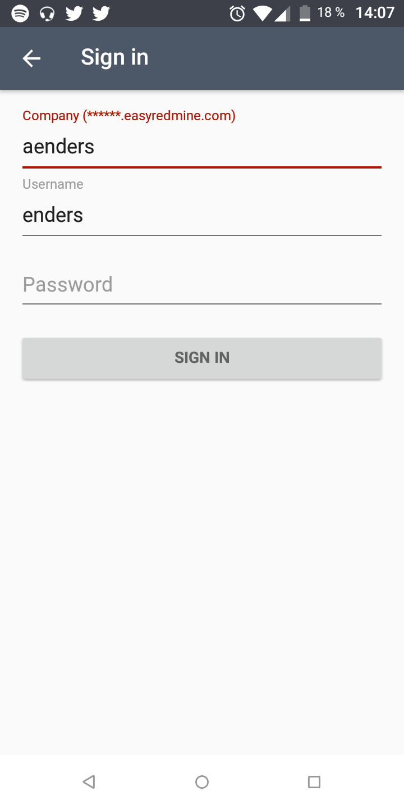
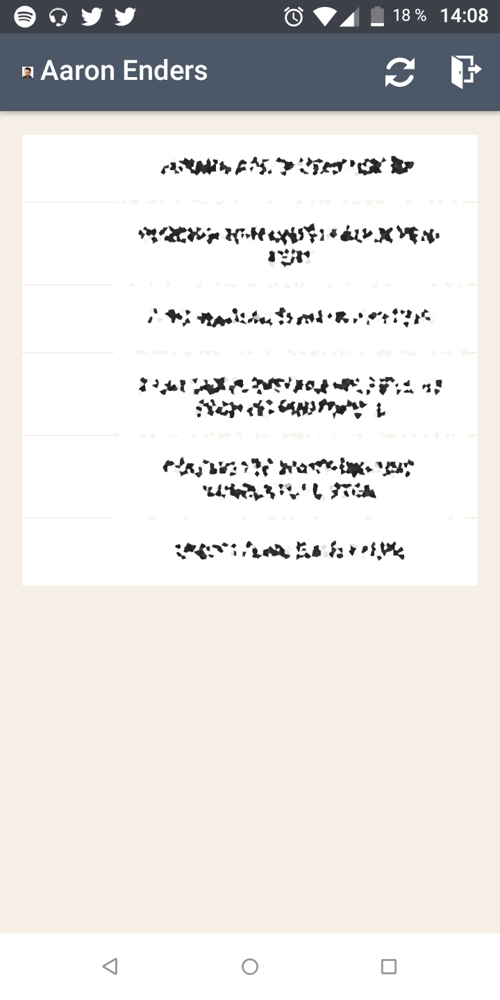

# easyRedmineTracker
Native Android App to track time via EasyRedmine API

Lists your issues and starts tracking time as soon as you tap one. When you start working on another issues, just tap it to switch the currently tracked issue.

Updates your tracked time in EasyRedmine automatically.

